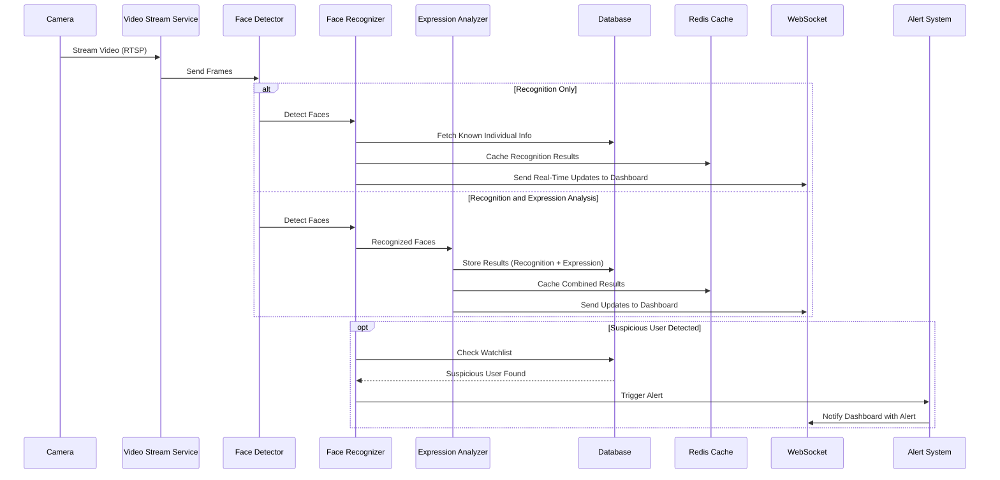
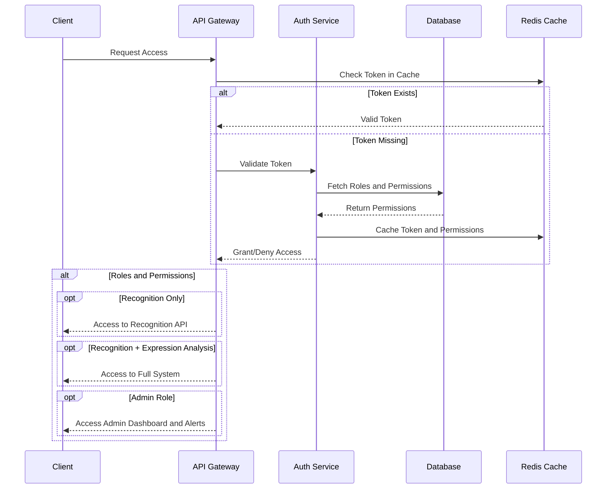

### **Project Documentation: Facial Expression and Face Recognition System**

---

#### **1. Project Overview**

This document provides a comprehensive guide to developing a **Facial Expression and Face Recognition System**. The system integrates with CCTV and other compatible cameras, enabling **real-time face detection**, **recognition**, and **facial expression analysis**. It features a responsive web dashboard designed for personal, institutional, and governmental use. Additionally, it fetches individual details from connected databases after recognition and can flag suspicious individuals with real-time alerts.

---

#### **2. Key Features**
1. **Face Detection**: Identify faces in live or recorded video streams.
2. **Face Recognition**: Match detected faces against a database of known individuals.
3. **Facial Expression Analysis**: Classify emotional states such as happiness, anger, or surprise.
4. **Suspicious Individual Alerts**: Identify and alert users to flagged individuals in real-time.
5. **Scalability**: Serve multiple institutions simultaneously with configurable features.
6. **User Dashboard**: A React-based web interface for managing and monitoring the system.
7. **Integration with CCTV**: Support for IP-based CCTV systems and other camera setups.
8. **Role-Based Access Control**: Different levels of access based on user roles and permissions.

---

#### **3. Technology Stack**

**Frontend**:  
- **React.js**: Create an interactive, dynamic, and responsive user interface.  
- **WebSocket**: For real-time data updates to the user dashboard.  

**Backend**:  
- **Django**: Provide a robust and scalable API server.  
- **Django Rest Framework**: Create secure, RESTful APIs for system functionality.  

**Machine Learning Models**:  
- **TensorFlow**: Power face detection, recognition, and expression analysis models.  
- **OpenCV**: Handle video and image preprocessing.  

**Database**:  
- **PostgreSQL**: Persistent storage for user profiles, face embeddings, and logs.  
- **Redis**: Enable caching and quick retrieval of temporary data.  

**Deployment**:  
- **Docker**: Containerize the application for portability and efficiency.  
- **Kubernetes**: (Optional) Orchestrate containerized deployment for scalability.  

---

#### **4. System Architecture**
The system comprises:
1. **Frontend**: React-based web dashboard.
2. **Backend**: Django server with integrated ML models for face recognition and expression analysis.
3. **Databases**: PostgreSQL for persistent data and Redis for caching.
4. **Camera Integration**: IP-based camera feeds processed in real-time.
5. **Alert System**: Trigger notifications for flagged individuals.

---

#### **5. Component Interaction Flow**

1. **Video Stream Processing Flow**  
   This flow describes the steps for capturing, analyzing, and displaying live video streams.

2. **Authentication Flow**  
   This flow manages user access with role-based permissions.

---

#### **6. Roadmap and Development Phases**

| **Phase**               | **Deliverable**                                  | **Timeline**   |
|-------------------------|--------------------------------------------------|----------------|
| **Requirement Analysis**| Use case specification and architecture design. | Week 1         |
| **Setup Environment**   | Development tools installed and project setup.  | Week 2         |
| **Model Development**   | Face detection and recognition models trained.  | Weeks 3-5      |
| **Backend Development** | RESTful API with integration of ML models.      | Weeks 6-7      |
| **Frontend Development**| React dashboard for system management.          | Weeks 8-9      |
| **System Integration**  | End-to-end working prototype.                   | Week 10        |
| **Deployment**          | Application deployed on a cloud platform.       | Week 11        |

---

#### **7. Expected Outcomes**
- **A scalable system** for facial recognition and expression analysis.
- **Real-time updates** for live monitoring.
- **User-friendly interface** for system management.
- **Robust alert mechanism** for suspicious user detection.

---

Let me know if you'd like refinements or additions to this documentation!