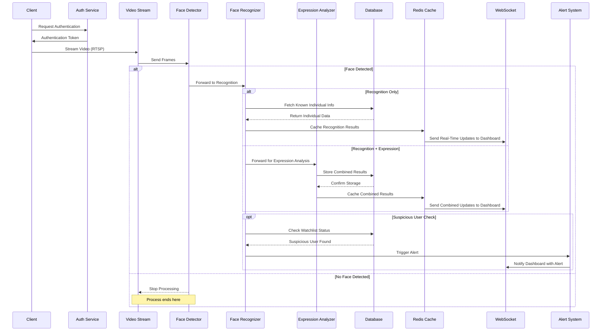
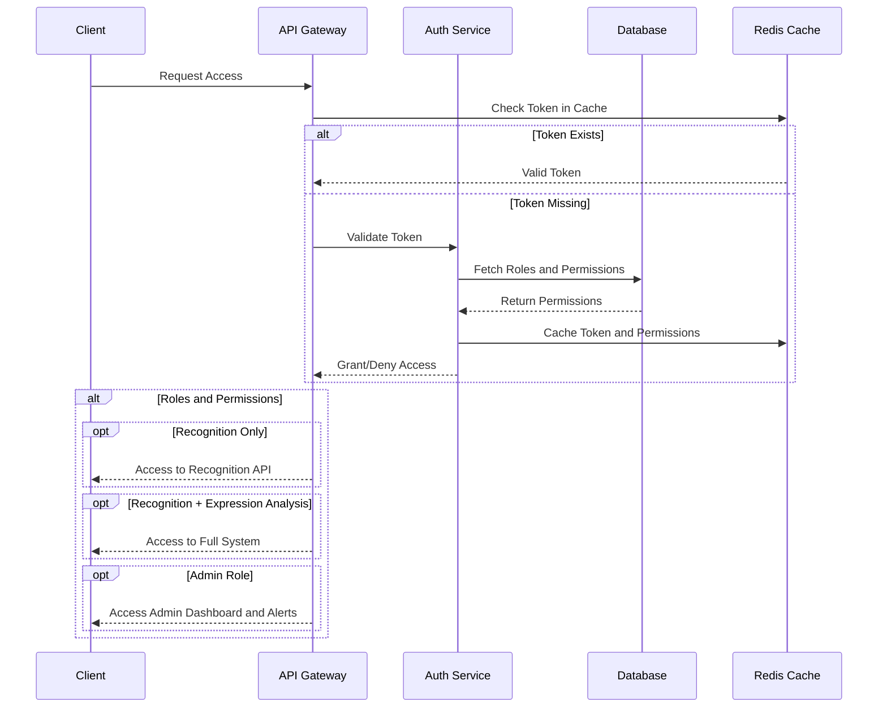

### **Project Documentation: Facial Expression and Face Recognition System**

---

#### **1. Project Overview**

This document provides a comprehensive guide to developing a **Facial Expression and Face Recognition System**. The system integrates with CCTV and other compatible cameras, enabling **real-time face detection**, **recognition**, and **facial expression analysis**. It features a responsive web dashboard designed for personal, institutional, and governmental use. Additionally, it fetches individual details from connected databases after recognition and can flag suspicious individuals with real-time alerts.

---

#### **2. Key Features**
1. **Face Detection**: Identify faces in live or recorded video streams.
2. **Face Recognition**: Match detected faces against a database of known individuals.
3. **Facial Expression Analysis**: Classify emotional states such as happiness, anger, or surprise.
4. **Suspicious Individual Alerts**: Identify and alert users to flagged individuals in real-time.
5. **Scalability**: Serve multiple institutions simultaneously with configurable features.
6. **User Dashboard**: A React-based web interface for managing and monitoring the system.
7. **Integration with CCTV**: Support for IP-based CCTV systems and other camera setups.
8. **Role-Based Access Control**: Different levels of access based on user roles and permissions.

---

#### **3. Technology Stack**

**Frontend**:  
- **React.js**: Create an interactive, dynamic, and responsive user interface.  
- **WebSocket**: For real-time data updates to the user dashboard.  

**Backend**:  
- **Django**: Provide a robust and scalable API server.  
- **Django Rest Framework**: Create secure, RESTful APIs for system functionality.

**Machine Learning Models**:  
- **TensorFlow**: Power face detection, recognition, and expression analysis models.  
- **OpenCV**: Handle video and image preprocessing.  

**Database**:  
- **PostgreSQL**: Persistent storage for user profiles, face embeddings, and logs.  
- **Redis**: Enable caching and quick retrieval of temporary data.  

**Deployment**:  
- **Docker**: Containerize the application for portability and efficiency.  
- **Kubernetes**: (Optional) Orchestrate containerized deployment for scalability.  

---

#### **4. System Architecture**
The system comprises:
1. **Frontend**: React-based web dashboard.
2. **Backend**: Django server with integrated ML models for face recognition and expression analysis.
3. **Databases**: PostgreSQL for persistent data and Redis for caching.
4. **Camera Integration**: IP-based camera feeds processed in real-time.
5. **Alert System**: Trigger notifications for flagged individuals.

---

1. **Video Stream Processing Flow**  
   This flow describes the steps for capturing, analyzing, and displaying live video streams.

---

2. **Authentication Flow**  
   This flow manages user access with role-based permissions.

---

### **5. Project Implementation Roadmap**

---

### **Phase 1: Requirement Analysis and Planning (Weeks 1–2)**

#### **1.1 System Requirements Definition**

**Business Requirements:**
- **Use Cases**: Define distinct operational scenarios for personal, institutional, and governmental sectors.
- **KPIs**: Specify quantifiable success metrics (e.g., detection accuracy ≥ 95%, response time < 500 ms).
- **Security & Privacy**: Outline compliance with standards (e.g., GDPR, HIPAA).
- **User Roles**: Detail hierarchical access levels (e.g., Admin, Operator, Viewer).
- **Notification Protocols**: Define triggers and communication channels (e.g., email, SMS, app notifications).

**Technical Requirements:**

- **Hardware Specifications**:
  - Camera: Resolution ≥ 1080p, FPS ≥ 30, RTSP/HTTP stream support.
  - Server: Multi-core CPUs, GPUs with CUDA support, 32+ GB RAM, SSD storage.
  - Network: Minimum bandwidth requirements; redundancy for high availability.
  - Backup: Define data replication and recovery strategies.

- **Software Requirements**:
  - Frameworks: TensorFlow/PyTorch for ML; Django for backend; React for frontend.
  - Database: PostgreSQL for structured data; Redis for caching.
  - Orchestration: Kubernetes/Docker Swarm for container management.
  - Monitoring: Tools like Prometheus and Grafana for real-time insights.

---

#### **1.2 System Architecture Design**
- **Modularity**: Define distinct components for ML, API, frontend, and data storage.
- **Inter-module Communication**: Use RESTful APIs and WebSockets for synchronous/asynchronous data exchange.
- **Data Flow**: Map end-to-end data handling, from ingestion (camera feed) to actionable insights (dashboard display).
- **Scalability**: Plan horizontal scaling strategies, including container-based deployments.
- **Security**: Include TLS for encrypted communications, role-based access control (RBAC), and intrusion detection.
- **Disaster Recovery**: Design for automated backups and failover capabilities.

---

### **Phase 2: Development Environment Setup (Week 3)**

#### **2.1 Development Tools Setup**
- **Environment Configuration**:
  - Separate environments for development, staging, and production.
  - Use configuration management tools (e.g., Ansible, Terraform).
- **Version Control**: Git repository with branch management strategy (e.g., GitFlow).
- **Automated Testing**: Implement unit, integration, and regression testing pipelines.
- **CI/CD Pipelines**: Use tools like Jenkins or GitHub Actions for automated builds and deployments.
- **Development Standards**: Define coding conventions, documentation templates, and commit message guidelines.

---

#### **2.2 Project Structure Organization**
- Backend: Organize services into modules for authentication, analytics, and processing.
- Frontend: Modularize UI components for scalability and reusability.
- ML Pipeline: Create directories for model training, inference scripts, and evaluation metrics.
- Documentation: Structure for API specs, developer guides, and system architecture diagrams.
- Logging & Monitoring: Centralize logs using tools like ELK stack (Elasticsearch, Logstash, Kibana).

---

### **Phase 3: Machine Learning Pipeline Development (Weeks 4–6)**

#### **3.1 Data Management Strategy**
- **Data Acquisition**: Integrate publicly available datasets (e.g., LFW, FER2013).
- **Preprocessing**: Standardize resolution, normalize pixel values, and augment data for robustness.
- **Validation**: Implement data validation scripts to filter corrupted or mislabeled samples.
- **Versioning**: Use DVC (Data Version Control) for tracking changes in datasets.
- **Storage**: Configure scalable storage solutions (e.g., AWS S3, local NAS).

---

#### **3.2 Model Development Framework**
- **Face Detection**:
  - **Algorithms**: Use MTCNN for multi-scale detection; optimize for FPS.
  - **Performance Metrics**: Precision, recall, and latency benchmarks.

- **Face Recognition**:
  - **Embedding Generation**: Implement using FaceNet or ResNet-50.
  - **Matching**: Optimize similarity matching using cosine or Euclidean distance.
  - **Accuracy**: Evaluate using ROC curves and confusion matrices.

- **Expression Analysis**:
  - **Categories**: Happiness, sadness, anger, surprise, neutral.
  - **Thresholds**: Define minimum confidence levels (e.g., > 85%).
  - **Metrics**: Use F1-score for multi-class evaluation.

---

### **Phase 4: Backend Development (Weeks 7–8)**

#### **4.1 Core Services Development**
- Authentication: JWT-based user authentication and role management.
- Video Processing: Implement frame-by-frame extraction and real-time pipeline integration.
- ML Integration: Load TensorFlow models for inference.
- Alerting: Define real-time alert generation and delivery mechanisms.
- Analytics: Aggregate and visualize detection statistics.

---

#### **4.2 API Development**
- **RESTful API**: Adhere to OpenAPI standards.
- **WebSocket Services**: Implement real-time updates for live detection results.
- **Security**: Integrate OAuth2.0, input validation, and rate limiting.
- **Monitoring**: Use APM tools (e.g., New Relic) to track API performance.

---

### **Phase 5: Frontend Development (Weeks 9–10)**

#### **5.1 User Interface Development**
- **Dashboard**: Build using React with dynamic component rendering.
- **Real-time Monitoring**: Enable overlays for recognition results on video streams.
- **User Management**: CRUD operations for profiles and roles.
- **Visualization**: Use libraries like D3.js or Chart.js for analytics charts.

---

#### **5.2 Frontend Features**
- Real-time video display with detection highlights.
- Interactive dashboards for historical data analysis.
- Configurable alert thresholds and system settings.
- Multi-language support (if applicable).

---

### **Phase 6: System Integration & Testing (Week 11)**

#### **6.1 Integration Testing**
- **End-to-End**: Test workflows from video ingestion to result visualization.
- **Performance**: Conduct latency and throughput analysis.
- **Security**: Simulate penetration tests to identify vulnerabilities.
- **User Acceptance**: Validate usability with end-users.

#### **6.2 Performance Optimization**
- Cache frequently used data with Redis.
- Optimize database queries using indexes and materialized views.
- Use batch processing for high-throughput scenarios.

---

### **Phase 7: Deployment (Week 12)**

#### **7.1 Deployment Strategy**
- Automate deployments using Docker Compose or Kubernetes.
- Define rollback procedures for failed updates.
- Configure load balancers for high availability.

#### **7.2 Production Environment**
- Harden servers with firewalls and intrusion detection.
- Set up real-time monitoring dashboards.
- Establish nightly backups and restore tests.

---

### **Phase 8: Maintenance & Monitoring**

#### **8.1 System Monitoring**
- Track KPIs with Prometheus and Grafana.
- Configure alert thresholds for anomalies.
- Regularly review security logs for breaches.

#### **8.2 Maintenance Procedures**
- Schedule downtime for updates.
- Validate backups periodically.
- Scale system resources based on load projections.

---

#### **9. Roadmap and Development Phases**

| **Phase**               | **Deliverable**                                  | **Timeline**   |
|-------------------------|--------------------------------------------------|----------------|
| **Requirement Analysis**| Use case specification and architecture design. | Week 1         |
| **Setup Environment**   | Development tools installed and project setup.  | Week 2         |
| **Model Development**   | Face detection and recognition models trained.  | Weeks 3-5      |
| **Backend Development** | RESTful API with integration of ML models.      | Weeks 6-7      |
| **Frontend Development**| React dashboard for system management.          | Weeks 8-9      |
| **System Integration**  | End-to-end working prototype.                   | Week 10        |
| **Deployment**          | Application deployed on a cloud platform.       | Week 11        |

---

#### **7. Expected Outcomes**
- **A scalable system** for facial recognition and expression analysis.
- **Real-time updates** for live monitoring.
- **User-friendly interface** for system management.
- **Robust alert mechanism** for suspicious user detection.

