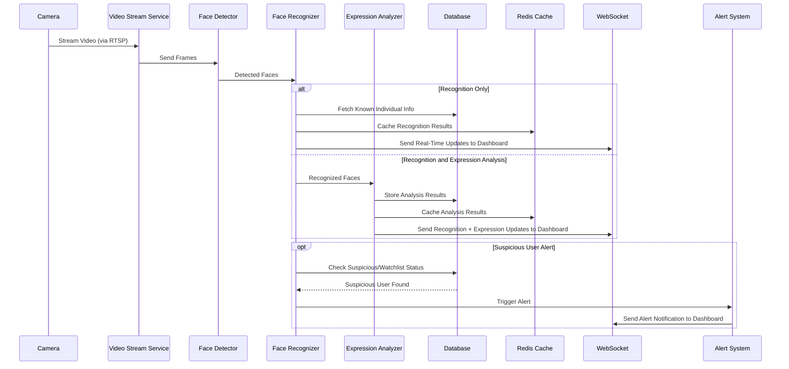
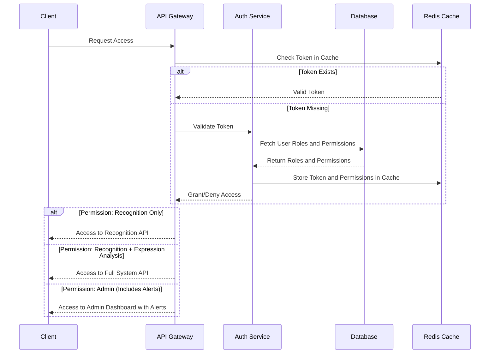

### **Project Documentation: Facial Expression and Face Recognition System**

---

#### **1. Project Overview**

This documentation provides a comprehensive guide to building a **Facial Expression and Face Recognition System**. The system will integrate with CCTV cameras and other compatible cameras, performing **face detection**, **recognition**, and **expression analysis**. It will provide real-time results through a user-friendly web dashboard, suitable for personal and institutional use.

---

#### **2. Key Features**
1. **Face Detection**: Identify faces in images and live video streams.
2. **Face Recognition**: Match detected faces with a database of known individuals.
3. **Facial Expression Analysis**: Classify emotions such as happiness, anger, and surprise.
4. **Real-Time Processing**: Process live camera feeds with minimal latency.
5. **User Dashboard**: A React-based frontend for visualizing and managing the system.
6. **Integration with CCTV Cameras**: Compatible with IP-based CCTV systems for seamless integration.
7. **Scalable Design**: Designed for personal, institutional, and government use.

---

#### **3. Technology Stack**

**Frontend (Web Application)**:
- **React.js**: Create an interactive and responsive user interface.

**Backend (API and Server)**:
- **Django**: For a robust and scalable backend.
- **Django Rest Framework (DRF)**: For creating RESTful APIs to connect the frontend with backend functionalities.

**Machine Learning Models**:
- **TensorFlow**: Implement and deploy models for face detection, recognition, and expression analysis.
- **OpenCV**: Handle image preprocessing and video stream processing.

**Database**:
- **PostgreSQL**: Store user profiles, face embeddings, and activity logs.

**Other Tools**:
- **Docker**: Containerize the application for easy deployment.
- **Redis**: Implement caching for improved performance.
- **Cloud Services (optional)**: For scalability using AWS/GCP/Azure.

---

#### **4. System Architecture**
The system consists of the following components:
1. **Frontend**: A React-based dashboard for user interaction.
2. **Backend**: A Django server with DRF for API management and business logic.
3. **Face Recognition and Expression Analysis**:
   - TensorFlow models integrated with the backend.
4. **Database**: PostgreSQL for persistent storage.
5. **Camera Integration**: IP-based cameras providing real-time streams.

---

### **4.1 Component Interaction Flow**

1. **Video Stream Processing Flow**


---

2. **Authentication Flow**


#### **5. Project Roadmap**

### **Phase 1: Requirement Analysis and Planning**
1. **Define Requirements**:
   - Specify system use cases, such as personal security or institutional monitoring.
   - Hardware: Cameras, GPUs, and servers.
   - Software: Python libraries, web stack, and deployment tools.

2. **Design System Architecture**:
   - Plan modular design for the components:
     - API layer (backend).
     - Machine learning layer (face detection, recognition, and expression analysis).
     - Frontend dashboard.

---

### **Phase 2: Environment Setup**
1. **Install Necessary Tools**:
   - Install Python, TensorFlow, Django, PostgreSQL, and Node.js.
   - Use virtual environments (e.g., `venv` or `conda`) for Python dependencies.

2. **Set Up Project Structure**:
   ```
   project/
   ├── backend/         # Django project
   ├── frontend/        # React app
   ├── models/          # AI models
   ├── data/            # Training and testing datasets
   ├── scripts/         # Utility scripts
   ├── docker/          # Docker configurations
   └── docs/            # Documentation
   ```

3. **Initialize Version Control**:
   - Create a Git repository to track progress.

---

### **Phase 3: Machine Learning Development**
#### **Step 1: Data Collection**
- Use publicly available datasets:
  - Face Recognition: **LFW**, **VGGFace2**.
  - Expression Analysis: **FER2013**, **CK+**.
- Prepare the data with necessary preprocessing.

#### **Step 2: Face Detection**
- Implement **MTCNN** or use **TensorFlow's Object Detection API**.
- Fine-tune pre-trained models for better performance in specific use cases.

#### **Step 3: Face Recognition**
- Train a model using **FaceNet** or **ResNet-based architecture** to generate embeddings.
- Store embeddings in the database for recognition.

#### **Step 4: Facial Expression Analysis**
- Train a CNN model for expression classification on datasets like FER2013.

#### **Step 5: Model Integration**
- Export models in **TensorFlow SavedModel format** for deployment.
- Test models locally using OpenCV.

---

### **Phase 4: Backend Development**
#### **Step 1: Set Up Django Project**
- Create a Django project and install **Django Rest Framework**.
- Define the backend structure:
  ```
  backend/
  ├── api/             # API logic
  ├── models/          # Machine learning models
  ├── database/        # Database configuration
  ├── authentication/  # User authentication
  └── tests/           # Unit tests
  ```

#### **Step 2: API Development**
- Create APIs for:
  - Uploading images or video streams for processing.
  - Fetching real-time recognition and expression analysis results.
  - Managing user data and face databases.

#### **Step 3: Integrate Models**
- Load pre-trained TensorFlow models into the Django backend.
- Use OpenCV to process live video feeds from cameras.

#### **Step 4: Database Integration**
- Set up PostgreSQL:
  - Store user profiles, face embeddings, and logs.
  - Use Django's ORM for data manipulation.

---

### **Phase 5: Frontend Development**
#### **Step 1: Set Up React Project**
- Create a new React project using `create-react-app`.
- Install libraries such as `axios` (for API calls), `react-router-dom` (for navigation).

#### **Step 2: Build Components**
- **Dashboard**: Display camera feeds and recognition results in real-time.
- **Logs Page**: Show historical logs of detected faces and expressions.
- **Settings**: Allow users to manage profiles, add cameras, and configure preferences.

#### **Step 3: API Integration**
- Use Axios to fetch and post data from the Django backend.
- Implement WebSockets or Server-Sent Events (SSE) for real-time updates.

---

### **Phase 6: System Integration**
1. **Connect CCTV Cameras**:
   - Use RTSP or HTTP-based streaming protocols to capture video feeds.
   - Integrate with OpenCV for frame-by-frame processing.

2. **Optimize Performance**:
   - Use TensorFlow’s **TFLite** for edge processing (if required).
   - Implement caching with Redis to reduce API latency.

3. **Test End-to-End Functionality**:
   - Validate all components, including the dashboard, backend APIs, and model inference.

---

### **Phase 7: Deployment**
1. **Containerization**:
   - Use Docker to containerize the application components.
   - Create separate containers for the frontend, backend, and database.

2. **Cloud Deployment**:
   - Deploy on AWS/GCP/Azure for scalability.
   - Use Kubernetes for orchestration if deploying on multiple servers.

3. **Edge Deployment** (optional):
   - Deploy models on edge devices like **NVIDIA Jetson Nano** for real-time local inference.

---

### **Phase 8: Maintenance and Updates**
1. **Continuous Updates**:
   - Improve models with more training data.
   - Fix bugs and add new features based on feedback.

2. **Monitor System Health**:
   - Use monitoring tools like Prometheus and Grafana for logs and performance metrics.

---

#### **6. Milestone Breakdown**
| **Milestone**            | **Timeline**  | **Deliverable**                            |
|--------------------------|---------------|--------------------------------------------|
| Requirement Analysis     | Week 1        | Detailed use cases and architecture design |
| Environment Setup        | Week 2        | Working development environment            |
| Model Development        | Weeks 3-5     | Trained face detection and recognition models |
| Backend Development      | Weeks 6-7     | Fully functional backend with APIs         |
| Frontend Development     | Weeks 8-9     | Interactive React-based dashboard          |
| Integration and Testing  | Week 10       | End-to-end working system                  |
| Deployment               | Week 11       | Deployed application                       |
| Maintenance              | Ongoing       | Regular updates and monitoring             |

---

### **7. Expected Outcomes**
- A scalable and efficient system capable of real-time face recognition and expression analysis.
- User-friendly web interface for monitoring and managing the system.
- Easy integration with existing CCTV systems and cameras.
